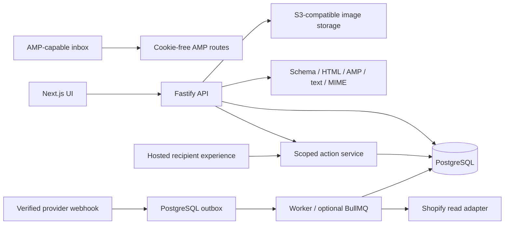

# Architecture

InboxFlow uses Next.js App Router/React/TypeScript for the UI and Fastify for the API. Zod defines the authoritative document, editor-operation, form, and request contracts. Zustand keeps local editor undo history; TanStack Query retrieves workspace metrics. dnd-kit implements keyboard/pointer sorting and library dragging; Radix handles accessible modal focus; Recharts renders charts.

`apps/web` contains marketing, workspace, editor and recipient pages. `apps/api` owns authentication, role checks, token execution, exports, records, consent and provider routes. `apps/worker` consumes durable catalog-sync jobs and performs daily retention cleanup when using network PostgreSQL.

`packages/shared` owns schemas and security primitives; `database` owns SQL/query abstraction/fixtures; `email-engine` owns rendering and validation; `integrations` owns providers/storage/OAuth; `analytics` owns aggregation and cohort statistics; `interactive-blocks` owns deterministic assisted editing; `configuration` validates environment configuration. Packages are source modules compiled by the root TypeScript project; the web app is a pnpm workspace package.

PostgreSQL is the normal concurrent deployment database. PGlite provides a persistent PostgreSQL engine for the single-process demo and isolated test databases. Its single connection is serialized; it is not a multi-process substitute for network PostgreSQL. Transactions use AsyncLocalStorage so nested services share the active transaction.

Tenant keys are explicit in service queries and composite relationships. There is no PostgreSQL RLS claim: enforcement currently resides in the API, scoped services and constraints. Generic `entities` consolidate smaller typed aggregates while security/payment-critical tables are explicit.

Provider writes are simulated for recipient workflows. OAuth, catalog/template reads, and optional Stripe test checkout use real HTTP contracts. Connections store encrypted secrets; UI responses contain mode/status/metadata only. The worker publishes a catalog snapshot only after the full read succeeds. The queue is at-least-once; completed jobs and provider webhook IDs prevent repeated local application.

OpenTelemetry API spans and latency measurements have low-cardinality route attributes. Without an installed SDK/exporter these hooks are no-ops. Logs remove cookies, authorization, CSRF and query-string recipient tokens. A deployment collector and alerts must be configured separately.
