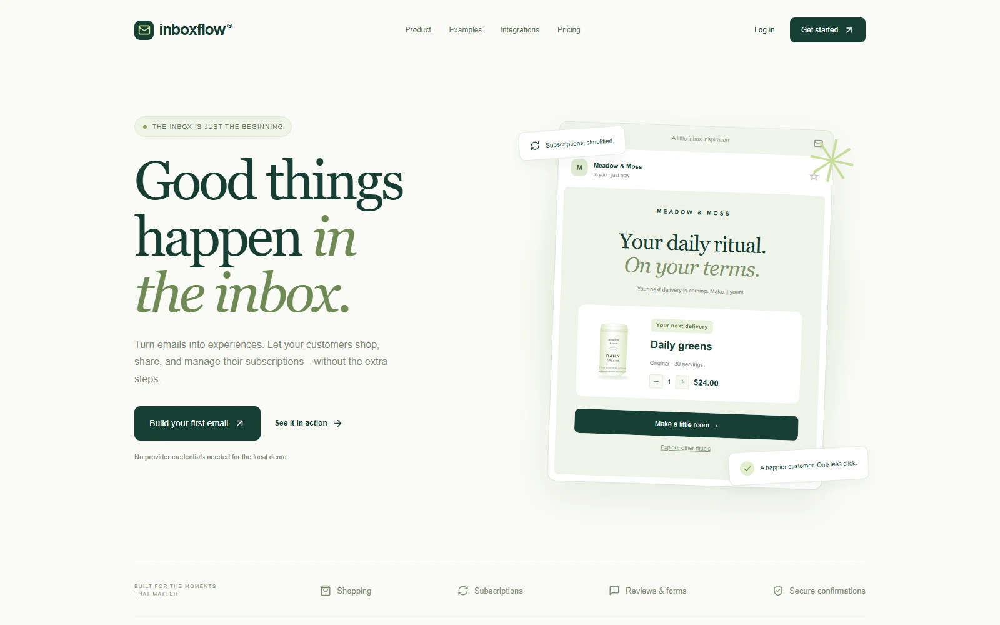
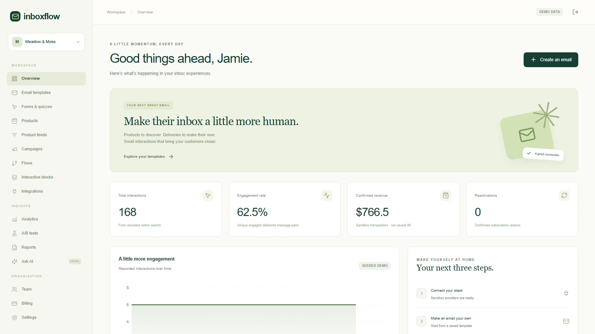
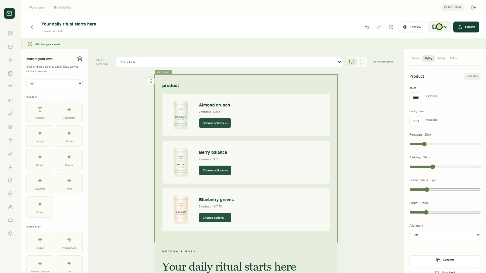
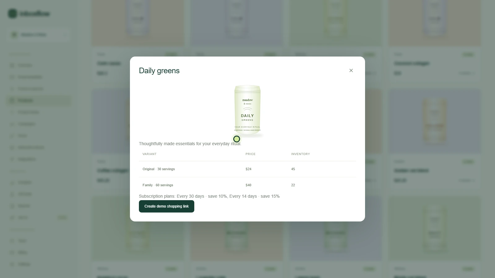
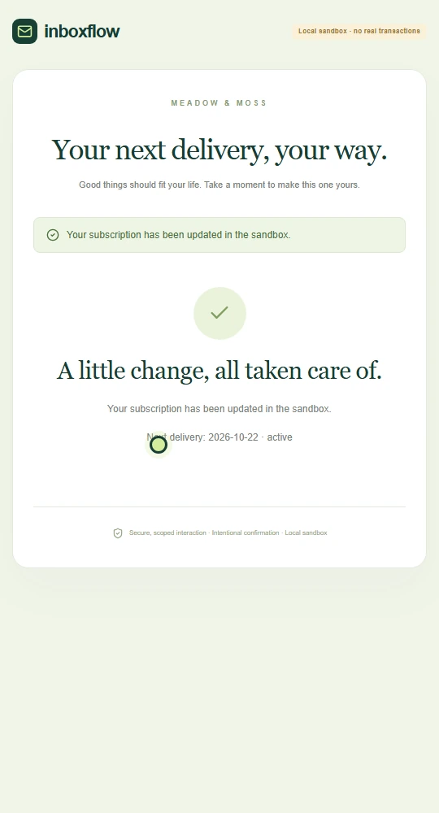
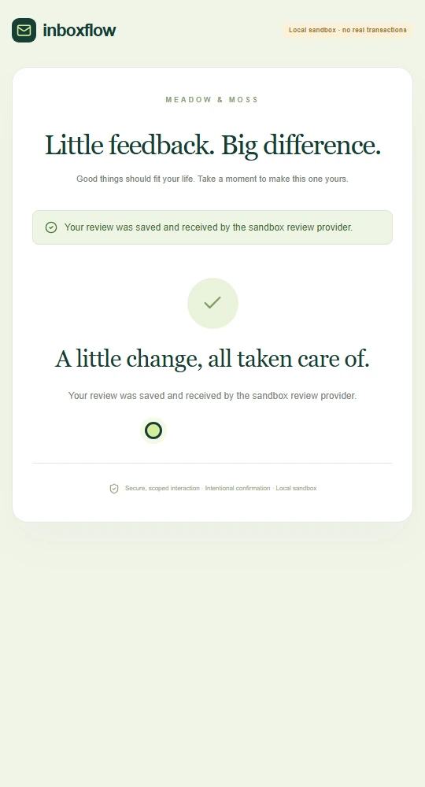
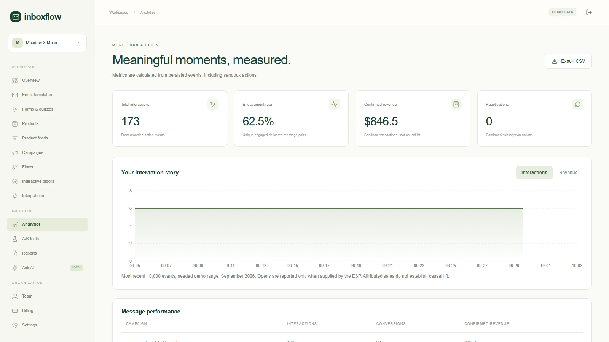
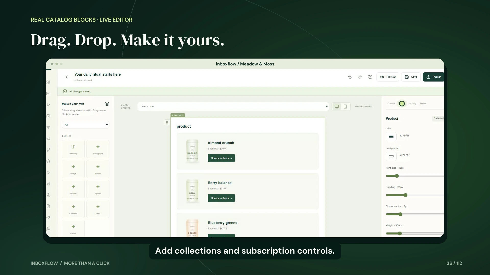
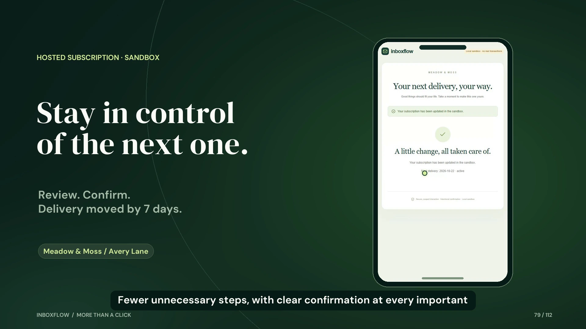
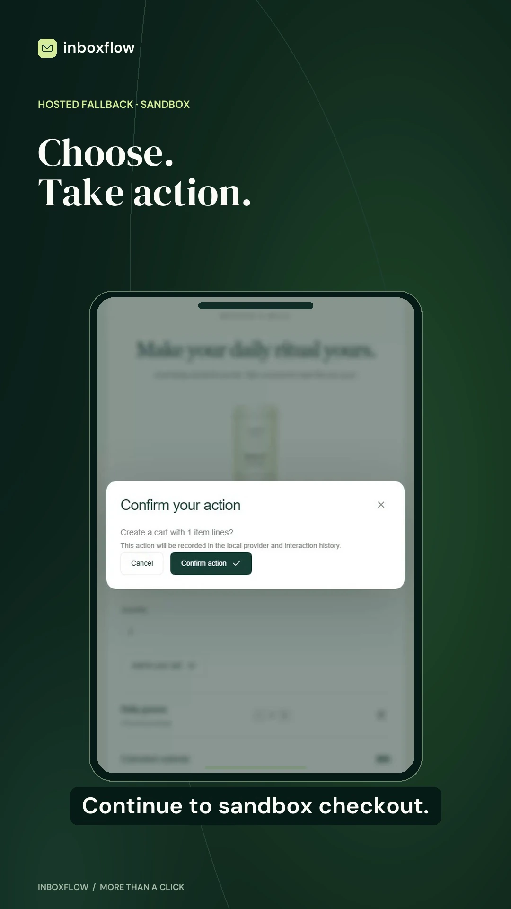

# Application and production samples

These images are actual local browser outputs or sample frames composed from captured application footage. All brands, customers and metrics are synthetic. Hosted pages use local sandbox providers; the email preview is a browser simulation.

## Marketing website

## Workspace

## Visual email builder

## Catalog and variants

## Confirmed subscription delay

## Saved feedback

## Analytics

## Film samples

See [video production](../video-production/README.md) for the editable project, SRTs, provenance, rendering commands and local MP4 delivery paths.
